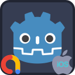

<p align="center">
  
</p>

---
#  iOS Admob Plugin

Enables AdMob functionality on Godot apps that are exported to the iOS platform and allows 
displaying of Admob ads.

_For Android version, visit https://github.com/cengiz-pz/godot-android-admob-plugin ._

##  Prerequisites
Follow instructions on the following page to prepare for iOS export:
- [Exporting for iOS](https://docs.godotengine.org/en/stable/tutorials/export/exporting_for_ios.html)

Create an AdMob account at the following link:
- [Google AdMob](https://admob.google.com/)
- create an app in AdMob console
- [create ad(s)](https://support.google.com/admob/answer/6173650?hl=en) for your app via the AdMob console
- if needed, [create consent form(s)](https://support.google.com/admob/answer/10113207?hl=en) for your app via the AdMob console

##  Installation
_Before installing this plugin, make sure to uninstall any previous versions of the same plugin._

_If installing both iOS and Android versions of the plugin in the same project, then make sure that both versions use the same addon interface version._

There are 2 ways to install the `Admob` plugin into your project:
- Through the Godot Editor's AssetLib
- Manually by downloading archives from Github

###  Installing via AssetLib
Steps:
- search for and select the `Admob` plugin in Godot Editor
- click `Download` button
- on the installation dialog...
	- keep `Change Install Folder` setting pointing to your project's root directory
	- keep `Ignore asset root` checkbox checked
	- click `Install` button
- enable the addon via the `Plugins` tab of `Project->Project Settings...` menu, in the Godot Editor
- enable the plugin via the `iOS` section of `Project->Export...` menu, in the Godot Editor

####  Installing both iOS and Android versions of the plugin in the same project
When installing via AssetLib, the installer may display a warning that states "_[x number of]_ files conflict with your project and won't be installed." You can ignore this warning since both versions use the same addon code.

###  Installing manually
Steps:
- download release archive from Github
- unzip the release archive
- copy to your Godot project's root directory
- enable the addon via the `Plugins` tab of `Project->Project Settings...` menu, in the Godot Editor
- enable the plugin via the `iOS` section of `Project->Export...` menu, in the Godot Editor


##  App Tracking Transparency
App Tracking Transparency, or ATT for short, is Apple's opt-in privacy framework that requires all iOS apps to ask users for permission to share their data. This is done in the form of a popup where users can either consent or deny tracking.

* To enable ATT in your app
	- Enter a descriptive text that will be displayed on the ATT dialog in your `Admob` node's `att_text`field.
	- Call `Admob` node's `request_tracking_authorization()` method.
	- Handle `Admob` node's `tracking_authorization_granted` and `tracking_authorization_denied` signals.
* If the user initially rejects the tracking request, then later on you can check if the user changed their mind and allow them to change their decision by opening the system app settings using the `Admob` node's `open_app_settings()` method.


##  Usage
- Add `Admob` node to your main scene and populate the ID fields of the node
	- Debug IDs will only be used when your Godot app is run in debug mode
	- Real IDs will only be used when the `is_real` field of the node is set to `true`

- register listeners for one or more of the following signals of the `Admob` node:
	- `initialization_completed(status_data: InitializationStatus)`
	- `banner_ad_loaded(ad_id: String)`
	- `banner_ad_failed_to_load(ad_id: String, error_data: LoadAdError)`
	- `banner_ad_refreshed(ad_id: String)`
	- `banner_ad_clicked(ad_id: String)`
	- `banner_ad_impression(ad_id: String)`
	- `banner_ad_opened(ad_id: String)`
	- `banner_ad_closed(ad_id: String)`
	- `interstitial_ad_loaded(ad_id: String)`
	- `interstitial_ad_failed_to_load(ad_id: String, error_data: LoadAdError)`
	- `interstitial_ad_refreshed(ad_id: String)`
	- `interstitial_ad_impression(ad_id: String)`
	- `interstitial_ad_clicked(ad_id: String)`
	- `interstitial_ad_showed_full_screen_content(ad_id: String)`
	- `interstitial_ad_failed_to_show_full_screen_content(ad_id: String, error_data: AdError)`
	- `interstitial_ad_dismissed_full_screen_content(ad_id: String)`
	- `rewarded_ad_loaded(ad_id: String)`
	- `rewarded_ad_failed_to_load(ad_id: String, error_data: LoadAdError)`
	- `rewarded_ad_impression(ad_id: String)`
	- `rewarded_ad_clicked(ad_id: String)`
	- `rewarded_ad_showed_full_screen_content(ad_id: String)`
	- `rewarded_ad_failed_to_show_full_screen_content(ad_id: String, error_data: AdError)`
	- `rewarded_ad_dismissed_full_screen_content(ad_id: String)`
	- `rewarded_ad_user_earned_reward(ad_id: String, reward_data: RewardItem)`
	- `rewarded_interstitial_ad_loaded(ad_id: String)`
	- `rewarded_interstitial_ad_failed_to_load(ad_id: String, error_data: LoadAdError)`
	- `rewarded_interstitial_ad_impression(ad_id: String)`
	- `rewarded_interstitial_ad_clicked(ad_id: String)`
	- `rewarded_interstitial_ad_showed_full_screen_content(ad_id: String)`
	- `rewarded_interstitial_ad_failed_to_show_full_screen_content(ad_id: String, error_data: AdError)`
	- `rewarded_interstitial_ad_dismissed_full_screen_content(ad_id: String)`
	- `rewarded_interstitial_ad_user_earned_reward(ad_id: String, reward_data: RewardItem)`
	- `consent_form_loaded`
	- `consent_form_dismissed(error_data: FormError)`
	- `consent_form_failed_to_load(error_data: FormError)`
	- `consent_info_updated`
	- `consent_info_update_failed(error_data: FormError)`
	- `tracking_authorization_granted`
	- `tracking_authorization_denied`
- initialize the plugin
	- call the `initialize()` method of the `Admob` node
	- wait for the `initialization_completed` signal
- use one or more of the following `load_*()` methods to load ads from the `Admob` node:
	- `load_banner_ad(ad_request: LoadAdRequest)`
	- `load_interstitia_adl(ad_request: LoadAdRequest)`
	- `load_rewarded_ad(ad_request: LoadAdRequest)`
	- `load_rewarded_interstitial_ad(ad_request: LoadAdRequest)`
- the `Admob` node will emit the following signals once ads have been loaded or failed to load:
	- `banner_ad_loaded(ad_id: String)`
	- `banner_ad_failed_to_load(ad_id: String, error_data: LoadAdError)`
	- `interstitial_ad_loaded(ad_id: String)`
	- `interstitial_ad_failed_to_load(ad_id: String, error_data: LoadAdError)`
	- `rewarded_ad_loaded(ad_id: String)`
	- `rewarded_ad_failed_to_load(ad_id: String, error_data: LoadAdError)`
	- `rewarded_interstitial_ad_loaded(ad_id: String)`
	- `rewarded_interstitial_ad_failed_to_load(ad_id: String, error_data: LoadAdError)`
- once ads have been loaded, call corresponding `show_*()` method from the `Admob` node with the `ad_id` received:
	- `show_banner_ad(ad_id: String)`
	- `show_interstitial_ad(ad_id: String)`
	- `show_rewarded_ad(ad_id: String)`
	- `show_rewarded_interstitial_ad(ad_id: String)`


##  iOS Export
iOS export requires several configuration settings.

###  File-based Export Configuration
In order to enable file-based export configuration, an `export.cfg` file should be placed in the `addons/AdmobPlugin` directory with the file contents formatted as in the example below:

```
[General]
is_real = false

[Debug]
app_id = "ca-app-pub-3940256099942544~3347511713"

[Release]
app_id = "ca-app-pub-3940256099942544~3347511713"

[ATT]
att_enabled = true
att_text = "My ATT text."
```

The `is_real` and `app_id` configuration items are mandatory and if not found in the `export.cfg` file, then the plugin will fall back to node-based configuration.

###  Node-based Export Configuration
If `export.cfg` file is not found or file-based configuration fails, then the plugin will attempt to load node-based configuration.

During iOS export, the plugin searches for an `Admob` node in the scene that is open in the Godot Editor.  If not found, then the plugin searches for an `Admob` node in the project's main scene.  Therefore; 
- Make sure that the scene that contains the `Admob` node is selected in the Godot Editor when building and exporting for iOS, or
- Make sure that your Godot project's main scene contains an `Admob` node


##  Troubleshooting

### Missing APP ID
If your game crashes due to missing APP ID, then make sure that you enter your Admob APP ID in the Admob node and pay attention to the [iOS Export section](#ios-export).

### XCode logs
XCode logs are one of the best tools for troubleshooting unexpected behavior. View XCode logs while running your game to troubleshoot any issues.

### Troubleshooting guide
Refer to Godot's [Troubleshooting Guide](https://docs.godotengine.org/en/stable/tutorials/export/exporting_for_ios.html#troubleshooting).

<br/><br/>

---
#  Credits
Developed by [Cengiz](https://github.com/cengiz-pz)

Based on [Godot iOS Plugin Template](https://github.com/cengiz-pz/godot-ios-plugin-template)

Original repository: [Godot iOS Admob Plugin](https://github.com/cengiz-pz/godot-ios-admob-plugin)

<br/><br/>

___

#  Contribution

This section provides information on how to build the plugin for contributors.

<br/>

___

##  Prerequisites

- [Install SCons](https://scons.org/doc/production/HTML/scons-user/ch01s02.html)
- [Install CocoaPods](https://guides.cocoapods.org/using/getting-started.html)

<br/>

___

##  Build

- Run `./script/build.sh -A <godot version>` initially to run a full build
- Run `./script/build.sh -cgA <godot version>` to clean, redownload Godot, and rebuild
- Run `./script/build.sh -ca` to clean and build without redownloading Godot
- Run `./script/build.sh -cb -z4.0` to clean and build plugin without redownloading Godot and package in a zip archive as version 4.0
- Run `./script/build.sh -h` for more information on the build script

<br/>

___

##  Install Script

- Run `./script/install.sh -t <target directory> -z <path to zip file>` install plugin to a Godot project.
- Example `./script/install.sh -t demo -z bin/release/AdmobPlugin-v4.0.zip` to install to demo app.

<br/>

___

##  Git addon submodule


###  Creating

- `git submodule add -b main --force --name addon https://github.com/cengiz-pz/godot-admob-addon.git addon`

###  Updating

- Remove `addon` directory
- Run `git submodule update --remote --merge`

<br/>

___

##  Libraries

Library archives will be created in the `bin/release` directory.

<br/><br/>

---
#  All Plugins

| Plugin | Android | iOS |
| :---: | :--- | :--- |
| Notification Scheduler | https://github.com/cengiz-pz/godot-android-notification-scheduler-plugin | https://github.com/cengiz-pz/godot-ios-notification-scheduler-plugin |
| Admob | https://github.com/cengiz-pz/godot-android-admob-plugin | https://github.com/cengiz-pz/godot-ios-admob-plugin |
| Deeplink | https://github.com/cengiz-pz/godot-android-deeplink-plugin | https://github.com/cengiz-pz/godot-ios-deeplink-plugin |
| Share | https://github.com/cengiz-pz/godot-android-share-plugin | https://github.com/cengiz-pz/godot-ios-share-plugin |
| In-App Review | https://github.com/cengiz-pz/godot-android-inapp-review-plugin | https://github.com/cengiz-pz/godot-ios-inapp-review-plugin |
